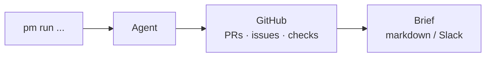

# Agentic PM

**A command-line toolkit that runs AI agents to automate product management busywork** — release readiness checks, sprint reports, meeting action items.

```bash
pip install -r requirements.txt
PYTHONPATH=src python -m agentic_pm.cli demo     # try it now, no tokens needed
```

## How it works



## What you get

**1. Release readiness in one command.** Point it at a repo, get a GO / CAUTION / NOT READY verdict with the receipts:

```bash
python -m agentic_pm.cli run release-train --repo owner/name
```

```
# Release readiness — owner/name
## Verdict: CAUTION — shippable with noted risks
## Signals
- Open PRs: **3** | Open bugs: **2** | Failing checks: **1**
## Risk flags
- 1 PR(s) open > 14 days (oldest: #42)
- failing checks on default branch: test / unit (3.12)
```

**2. Sprint reports that write themselves.** Merged PRs + closed issues from the last 7 days become a standup-ready report — the chore every PM hates, gone:

```bash
python -m agentic_pm.cli run sprint-report --repo owner/name --set days=7
```

**3. Meeting notes → action items.** Paste a transcript, get owners, tasks, and due dates:

```bash
python -m agentic_pm.cli run meeting-actions --set transcript=notes.txt
```

## Who this is for

Engineering managers and PMs who live in GitHub and are tired of status busywork. If you've ever spent Friday afternoon writing a sprint report from scattered PRs, this is your tool.

## Real usage

```bash
cp .env.example .env            # add GITHUB_TOKEN (ANTHROPIC_API_KEY optional)
python -m agentic_pm.cli init   # scaffold agentic-pm.yaml + .env

python -m agentic_pm.cli list                              # all agents
python -m agentic_pm.cli run release-train --repo o/r --out brief.md
```

Without `ANTHROPIC_API_KEY`, agents render deterministic briefs and say so — useful on a plane. With a key, you get LLM-polished executive summaries.

## The agents

| Agent | Status | The chore it kills |
|---|---|---|
| `release-train` | working | Manually checking "are we ready to ship?" |
| `sprint-report` | working | Writing Friday status reports from scattered PRs |
| `meeting-actions` | working | Mining transcripts for who-owes-what |
| `pr-triage` | planned | Figuring out which PRs need your eyes first |
| `backlog-groomer` | planned | Dedupe, score, and re-rank the backlog |

## Build your own agent

```python
from agentic_pm.agent import Agent

class MyAgent(Agent):
    name = "my-agent"                       # shows up in `pm list`
    description = "what it does"

    def run(self, **kwargs) -> str:         # return markdown
        ...
```

Drop it in `src/agentic_pm/agents/`, import it in `agents/__init__.py`, done — `pm run my-agent` just works. See `sprint_report.py` (~60 lines) for the pattern.

## Architecture

- `agent.py` — base class + registry (the plugin system)
- `config.py` — `agentic-pm.yaml` (repos, thresholds)
- `llm.py` — Anthropic wrapper with graceful no-key fallback
- `render.py` — markdown + Slack Block Kit output
- `connectors/` — data sources (GitHub today; Jira/Linear next)
- `agents/` — one module per agent

## Why this exists

The PM's job is coordination overhead, and coordination overhead is exactly what agents eat. This repo is the proof, one agent at a time.

## Privacy note

Set your git identity to GitHub's noreply address before your first commit:

```bash
git config user.email "<your-id>+<your-username>@users.noreply.github.com"
```

so your personal email never ends up in public commit history. (Learned the hard way.)

## License

MIT — build on it, ship it, tell us about it.
